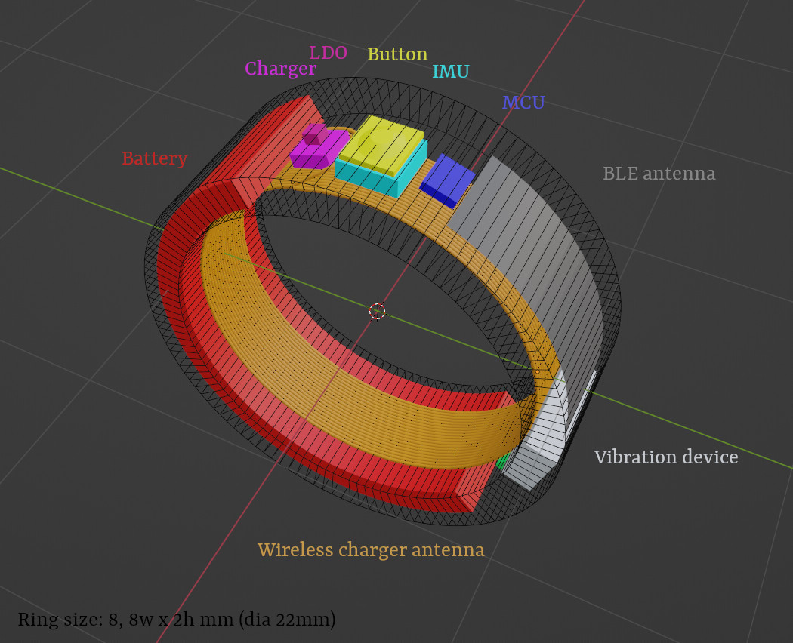
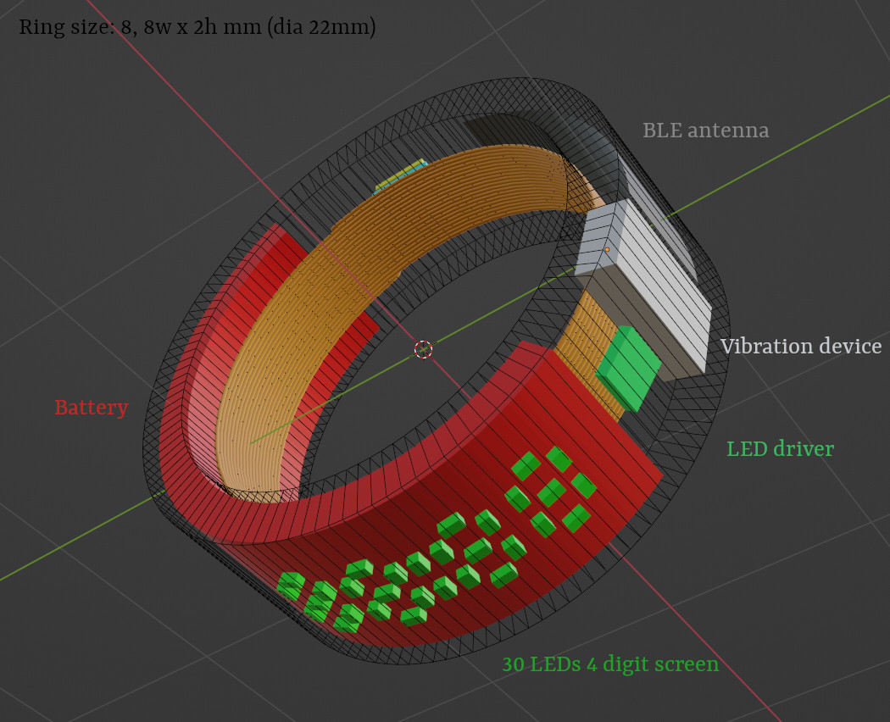

# RRing

Smart-Ring opensource project

## Features

* BLE connection to smartphone
* Programmable button
* Integrated IMU for positioning in space (3d mouse)
* Show clock on little led display
* Silent vibro alarm, notifications and feedback
* Wireless charging

## BOM

* SOC:
   * MCU: DA14531-OG2 (WLCSP 17)
   * BT Antenna: ??? TODO ??? 2.4 BLE PCB
* Power:
   * Wireless charger: LTC4124 (LQFN 12)
   * Wireless charger antenna: ???
   * LDO: ADP160ACBZ-1.8-R7 (WLCSP 4)
   * Battery: ??? TODO ??? Curved, Li, ~7x33x17.7mm
* Clock display:
   * 4 digit 7 segment LED driver: TCA6418EYFPR (DSBGA 25)
   * 30 LEDs: IN-S21AT (0201)
* Control:
   * Button: KMT071NGJLHS (IP68)
   * IMU: ICM-20948 (QFN 24)
* Additional:
   * Vibro feedback: ??? TODO ???

## Development

For PoC I used DA14531-00FXDEVKT-U (UM-B-125) - which is a small usb devboard with embedded debug
chip (uart/jtag), have spi flash to not disturb OTP ROM and safely play with firmware, just enough
to start. For sure you will need SDK for DA14531, you can easily get it on the manufacturer site.

Must read docs:
* [About devboard](https://www.renesas.com/us/en/document/mat/um-b-125-user-manual-da14531-usb-development-kit-hardware)
* [SDK6 tutorial](https://lpccs-docs.renesas.com/Tutorial_SDK6/introduction.html)
* [SDK6 peripherals tutorial](https://lpccs-docs.renesas.com/da145xx_tutorial_sdk6_peripherals/introduction.html)
* [SDK6 debugging](https://lpccs-docs.renesas.com/tutorial_da145xx_debugging_techniques/index.html)

### How to Build & Run

1. Download SDK (6.0.18.1182.1) and unpack to any directory
2. Download SmartSnippets Studio (2.0.20.4060), eclipse based IDE, and install it to the env
3. Run SmartSnippets Studio and specify the SDK - it will be used as workspace
4. Move to Exclipse IDE from welcome screen (ensure all the deps are installed)
5. Import the project as `General -> Projects from Folder or Archive` and navigate repo directory
`src/firmware/Eclipse`
6. Select DA14531 build profile and build the imported `rring` project
7. Connect USB devboard and run `Debug RAM_DA14531` to run the firmware on the chip
